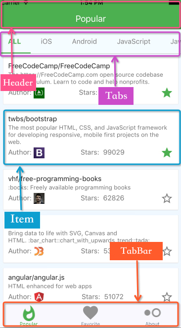
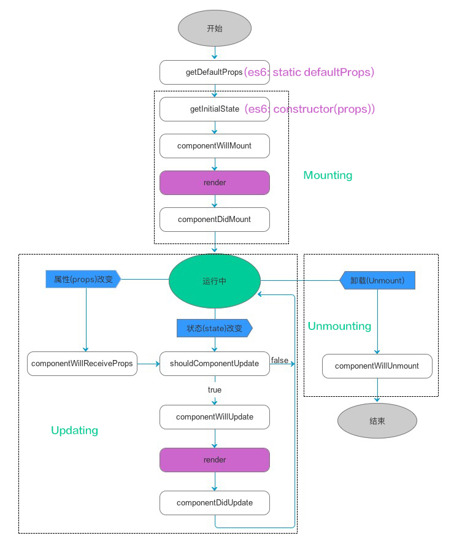

# react-native-started
React Native 入门学习练习 - Mac 环境

> Thanks:
> - [IMOOC - React Native 基础与入门](http://www.imooc.com/video/14287)
> - [Official Getting Started](http://facebook.github.io/react-native/docs/getting-started.html)
> - [React Native之React速学教程(上中下) - 贾鹏辉的技术博客](http://www.devio.org/2016/08/09/React-Native%E4%B9%8BReact%E9%80%9F%E5%AD%A6%E6%95%99%E7%A8%8B-(%E4%B8%8A)/)

## 组件
React 组件将 UI 分割成独立的、可复用的一些碎片或部分，这些部分是相关独立的。

组件是对 View 层的抽象。



### 修改入口文件
修改入口文件 `index.ios.js` `index.android.js`

```javascript
import {
    AppRegistry,
} from 'react-native';
import Setup from './js/Setup'

AppRegistry.registerComponent('sample', () => Setup);
```

### 创建组件
三种创建组件的方式：
- ES6 - 推荐。eg: [HelloComponent.js](sample/js/HelloComponent.js)
- ES5 eg: [HelloES5.js](sample/js/HelloES5.js)
- 函数式 - 无状态，不能使用 `this`，没有完整生命周期，可以使用 `props`。eg: [HelloFunc.js](sample/js/HelloFunc.js)

注意：
- 组件类的第一个字母必须大写。
- 组件类只能包含一个顶层标签。

> 由于 this.props 和 this.state 都用于描述组件的特性，可能会产生混淆。一个简单的区分方法是，this.props 表示那些一旦定义，就不再改变的特性，而 this.state 是会随着用户互动而产生变化的特性。

> render() 函数应该是纯粹的，也就是说该函数不修改组件的 state，每次调用都返回相同的结果，不读写 DOM 信息，也不和浏览器交互（例如通过使用 setTimeout）。
> 如果需要和浏览器交互，在 componentDidMount() 中或者其它生命周期方法中做这件事。保持 render() 纯粹，可以使服务器端渲染更加切实可行，也使组件更容易被理解。

### HTML 标签与 React 组件对比
React 可以渲染 HTML 标签 (strings) 或 React 组件 (classes)。

要渲染 HTML 标签，只需在 JSX 里使用小写字母开头的标签名。
```javascript
var myDivElement = <div className="foo" />;
React.render(myDivElement, document.body);
```

要渲染 React 组件，只需创建一个大写字母开头的本地变量。

React 的 JSX 里约定分别使用首字母大、小写来区分本地组件的类和 HTML 标签。

### 组件的生命周期
什么是组件的生命周期？
组件 装载 - 更新 - 卸载 的过程。
- Mounting：已插入真实 DOM。
- Updating：正在被重新渲染。
- Unmounting：已移出真实 DOM。



Mounting：
- getInitialState()/constructor(props) 在组件挂载之前调用一次。返回值将会作为 this.state 的初始值。
- componentWillMount() 服务器端和客户端都只调用一次，在初始化渲染执行之前立刻调用。
- componentDidMount() 在初始化渲染执行之后立刻调用一次，仅客户端有效（服务器端不会调用）。

Updating：
- componentWillReceiveProps(object nextProps) 在组件接收到新的 props 的时候调用。
- shouldComponentUpdate(object nextProps, object nextState) 在接收到新的 props 或者 state，将要渲染之前调用。（可以使用此方法灵活控制当 props 或 state 发生变化时是否要重新渲染组件。）
- componentWillUpdate(object nextProps, object nextState) 在接收到新的 props 或者 state 之前立刻调用。（不能在该方法中使用 this.setState()。如果需要更新 state 来响应某个 prop 的改变，请使用 componentWillReceiveProps。）
- componentDidUpdate(object prevProps, object prevState) 在组件的更新已经同步到 DOM 中之后立刻被调用。（该方法不会在初始化渲染的时候调用。使用该方法可以在组件更新之后操作 DOM 元素。）

Unmounting：
- componentWillUnmount 在组件从 DOM 中移除的时候立刻被调用。（在该方法中执行任何必要的清理，比如无效的定时器，或者清除在 componentDidMount 中创建的 DOM 元素。）

**Tips:**
- 在 Simulator 中 Cmd+R 选择 `Remote JS Debbugging` 将开启一个 [web 窗口](http://localhost:8081/debugger-ui) 再打开游览器的 Developer Tools 将可以看到 `console.log` 的内容。

### 组件、变量、方法的导入与导出
eg: [ExportComponent.js](sample/js/ExportComponent.js)

导出：
```javascript
// 导出变量、常量
export var myName = 'yifan';
export const myWebsite = 'zyf.im';

const age = 24;
const sex = 'male';
export {age, sex}

// 导出方法
export function sum(a, b) {
    return a + b;
}
```

导入：
```javascript
// 第一个为 default export，{} 中为其他 export 的
import ExportComponent, {myName, age, sum} from './ExportComponent'
```

### props
props 为从父组件传入的值，只读。 eg: [PropsTest.js](sample/js/PropsTest.js)

定义默认 props：
```javascript
static defaultProps = {
    name: 'default-yifan',
    sex: 'male',
};
```

检测 props 类型：
```javascript
static propTypes = {
    name: PropTypes.string,
    age: PropTypes.number.isRequired,
};
```
Tips：WebStorm command + left click `PropTypes.string` 可以看源码中的其他选项。

延展操作：
```javascript
var boyProps = {name: 'Liming', age: 6, sex: 'boy'};

...

<PropsTest {...boyProps}/>
```

结构赋值：
```javascript
var {name, age} = boyProps;
```

### state
eg: [StateTest.js](sample/js/StateTest.js)

Tip：导入图片文件后，会有报错，需要重启 server。

初始化
```javascript
// 初始化 方法一
state = {
    balloonSize: 10,
};
// 初始化 方法二（推荐）
constructor(props) {
    super(props);
    this.state = {
        balloonSize: 30,
    }
}
```
可以通过控制 `state` 控制一些 UI 动画。

### ref
eg: [RefTest.js](sample/js/RefTest.js)

```javascript
<Text style={styles.tip}
      onPress={() => {
          this.setState({
              balloonSize: this.refs.refStateTest.getSize(),
              //balloonSize: this.refs['refStateTest'].getSize(),
          })
      }}>
    click me to knew the ballonSize: {this.state.balloonSize}
</Text>

<StateTest ref='refStateTest'/>
```

```javascript
balloonSize: this.refStateTest.getSize(),

<StateTest ref={refStateTest=>this.refStateTest=refStateTest}/>
```

`getSize()` 是 `<StateTest/>` 中定义的一个方法。S

### class
eg: [Animal.js](sample/js/Animal.js)

```javascript
export default class Animal {
    // 构造方法，实例化的时候将会被调用，如果不指定，那么会有一个不带参数的默认构造函数。
    constructor(name, color) {
        this.name = name;
        this.color = color;
    }

    getInfo(){
        return ('name:' + this.name + ',color:' + this.color);
    }
}

export class Cat extends Animal {
    constructor(action) {
        // 子类必须要在 constructor 中指定 super 方法，否则在新建实例的时候会报错。
        // 如果没有置顶 consructor，默认带 super 方法的 constructor 将会被添加。
        super('cat','white');
        this.action = action;
    }

    getInfo(){
        return ('name:' + this.name + ',color:' + this.color+ ',action:' + this.action);
    }
}
```

```javascript
import Animal, {Cat} from './Animal'

var animal = new Animal('dog','white');
```